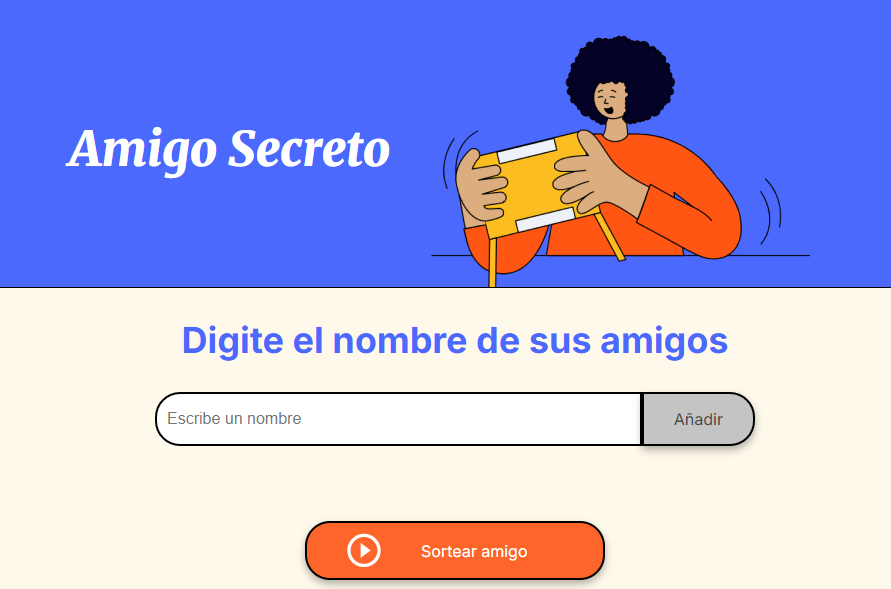
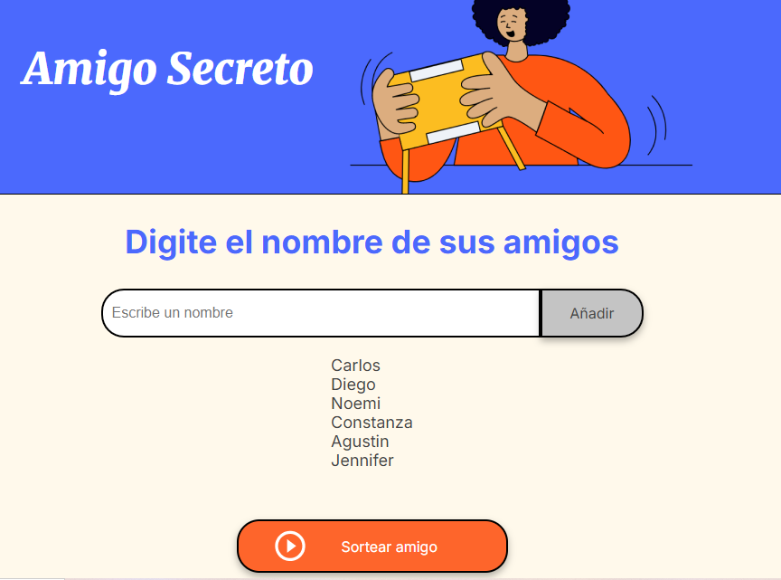
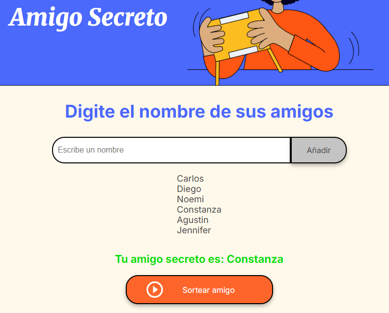
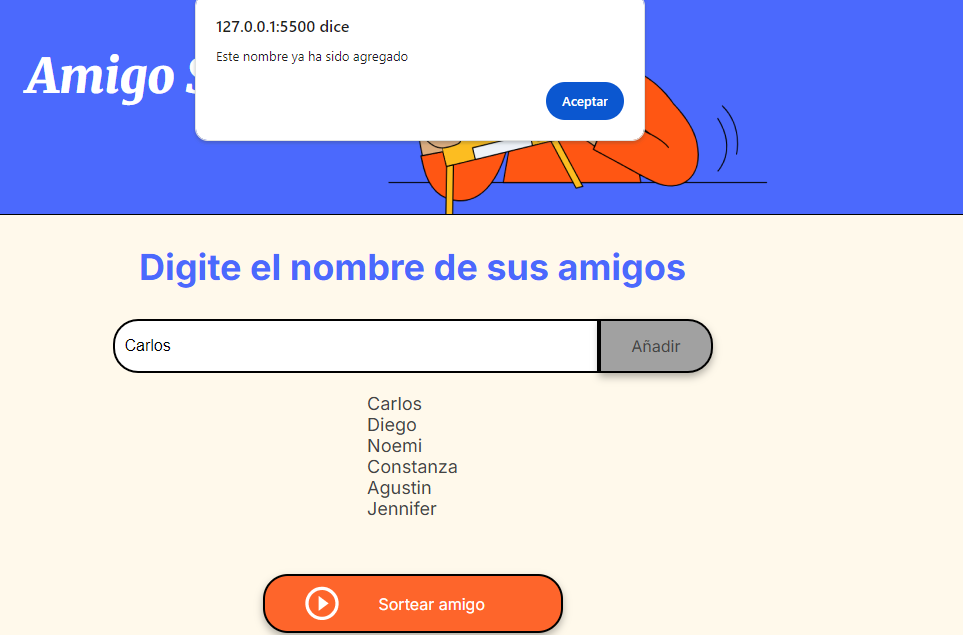
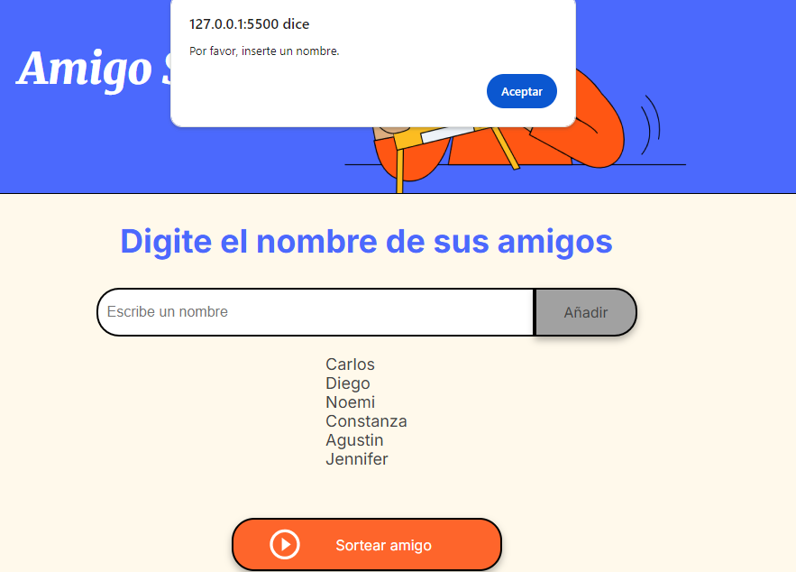
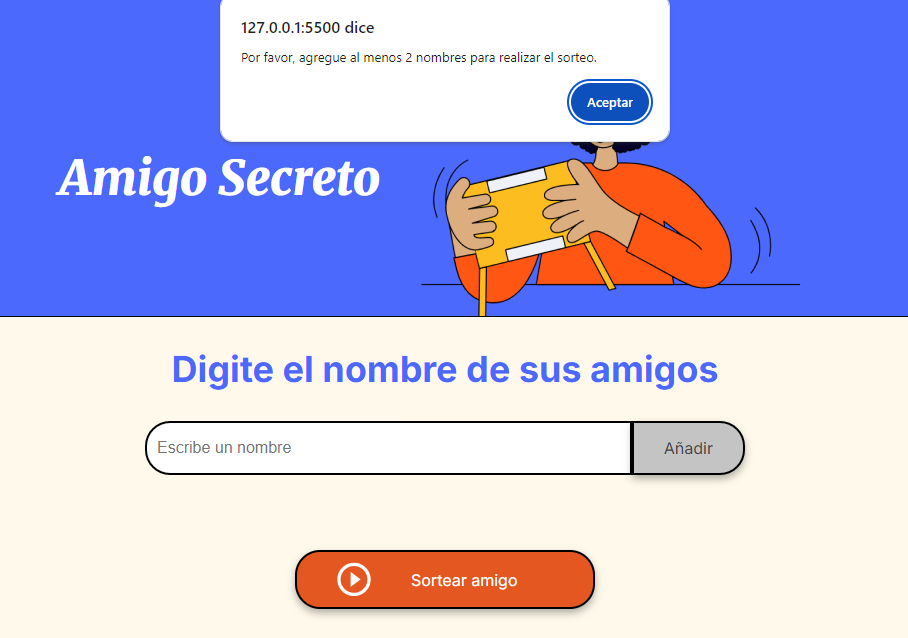
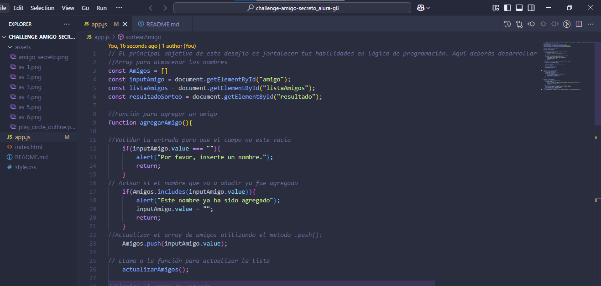
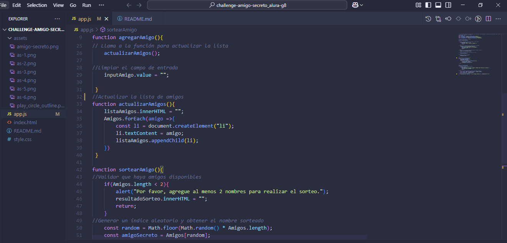
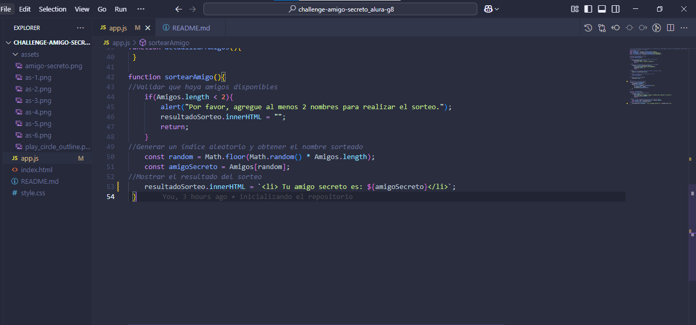

# challengue-ac
Challengue Amigo Secreto Alura Grupo 8-ONE por Alberto Correa

Actividad del challengue:

Dentro de la actividad se pidio que al seleccionar en el boton añadir se agregaran los amigos para realizar el sorteo

Al seleccionar el boton sortear amigo permitira mostrar cual es el amigo secreto que le toco a la persona

Se pidio que se mostrara una alerta al añadir un amigo ya ingresado anteriormente

También se pidio mostrar una alerta en caso de añadir un campo vacio como amigo

En caso de que la lista de amigos este vacia también se pedira que se agregue al menos dos personas para realizar el amigo secreto

A continuación les mostrare el codigo del Javascript realizado en el challengue

Este seria la actividad del challengue terminado, muchas gracias por haber tenido la oportunidad de haber participado en este proyecto